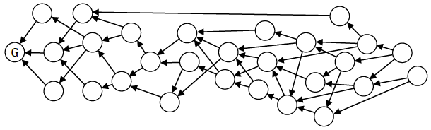

### 2、数据库结构
当用户想添加数据到这个去中心的数据库中，他需要创建一个新的存储单元并且广播给他的节点。这个存储单元（至少要）包含以下内容：

* 要存储的数据。一个存储单元可以包括多个数据包，称之为 *消息* 。有许多不同类型的消息，每一种都有自己的结构。其中一种消息是 *支付* ，用于给其他节点发送字节币或其它资产。

* 一个或多个用户签名创建的单元。用户由其地址标识。个人用户可以（并且鼓励）拥有多个地址，就像比特币一样。最简单的情况下，公钥导出地址，这再次类似比特币。

* 引用由其哈希值标识的一个或多个先前的单元（父母单元）。

引用父母单元建立存储单元的顺序（目前只是局部顺序）关系并逐步形成区块链结构。由于我们不局限于单亲-单子的这种连贯的块，所以我们不必争取近同步（性），并且可以安全地承受大的延迟和高吞吐量：每个单元只会有更多的父母单元和更多的子女单元。如果我们沿着父子链的历史前进，我们将会观察到许多分支，并且当同一个单元被后来的更多的单元引用时，许多单元将逐渐融合（开发者已经习惯看到这个动态）。这种结构在图论中称为定向无环图。单元是顶点，父子链是图的边缘。

图1，存储单元连接进一个DAG。箭头表示从子单元到父单元，G是创始单元。

&emsp;&emsp;在新单元极少到来的这种特殊情况下，DAG看起来就像一条链，偶尔快速分叉而又快合并。